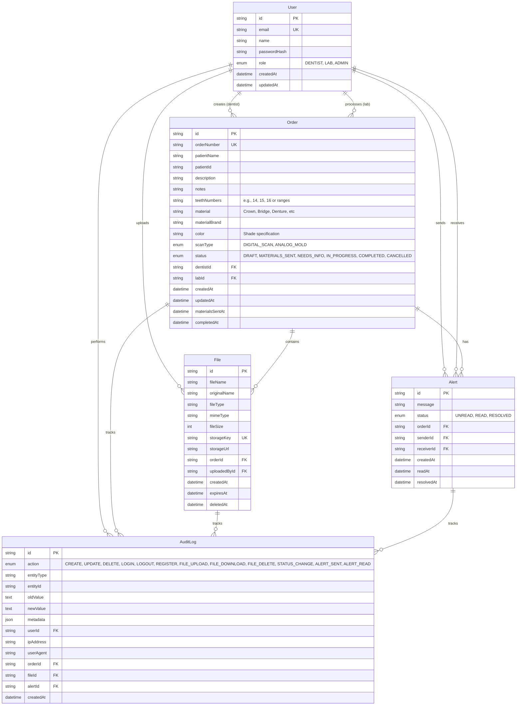

# Database Schema - LabWiseLink

## Entity Relationship Diagram

## Key Features

### 1. **User Management**
- Three roles: `DENTIST`, `LAB`, `ADMIN`
- Secure password hashing
- Email-based authentication

### 2. **Order Tracking**
- Unique order numbers
- Status workflow: `DRAFT` → `MATERIALS_SENT` → `IN_PROGRESS` → `COMPLETED`
- Special status: `NEEDS_INFO` (when lab needs clarification)
- Patient information stored with each order
- Timestamps for key transitions

### 3. **File Management**
- Support for STL files and images
- Metadata: original name, size, mime type
- R2 storage integration (storageKey, storageUrl)
- Auto-expiration (files older than 1 month)
- Soft delete support (deletedAt)

### 4. **Alert System**
- Lab can send alerts to dentist
- Dentist can send alerts to lab
- Alert statuses: `UNREAD` → `READ` → `RESOLVED`
- Linked to specific orders

### 5. **Audit Logging**
- Complete audit trail for compliance
- Tracks all actions: logins, file operations, status changes
- Stores old/new values for changes
- IP address and user agent tracking
- Flexible metadata field (JSON) for additional context
- Links to related entities (orders, files, alerts)

## Indexes for Performance

- **User**: `email`, `role`
- **Order**: `dentistId`, `labId`, `status`, `createdAt`, `orderNumber`
- **File**: `orderId`, `uploadedById`, `createdAt`, `expiresAt`, `storageKey`
- **Alert**: `orderId`, `senderId`, `receiverId`, `status`, `createdAt`
- **AuditLog**: `userId`, `action`, `entityType + entityId`, `createdAt`, `orderId`

## Data Retention

- Files: Auto-expire after 1 month (per sequence diagram)
- Audit logs: Retained indefinitely for compliance
- Soft deletes: Files marked with `deletedAt` instead of hard deletion
